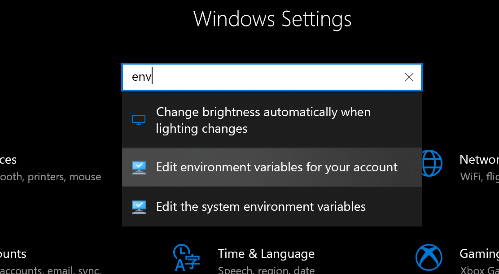
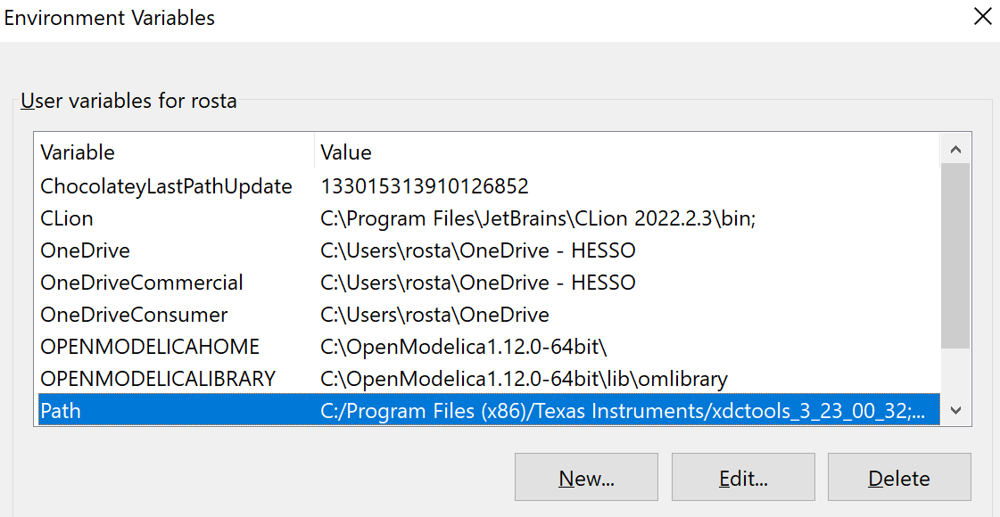
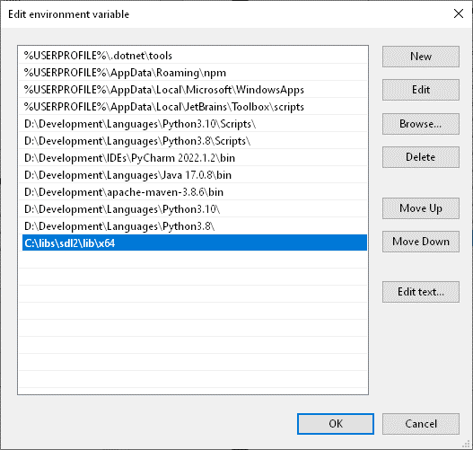

## Bienvenu sur le répo SDL2
Dans le cadre du cours de programmation PRG1, il est intéressant de pouvoir représenter graphiquement des situations et d'utiliser le clavier et la souris pour améliorer l'interface utilisateur.

Ce dossier met à disposition des étudiants de la [HEIG-VD](https://heig-vd.ch) les éléments permettant une prise en main rapide et facilitée avec des exemples de code utilisant la librairie SDL2.

## Table des matières

- [Liens utiles](readme.md#liens)
- [Installation MS Windows](readme.md#install_windows)
- [Installation MacOS](readme.md#install_macos)
- [Projet CLion / MS Windows](readme.md#projet_windows)
- [Projet CLion / MacOS](readme.md#install_macos)
- [Démo : 03\_Moving\_Point\_SDL](03_Moving_Point_SDL)
- [Démo : 05\_BubbleSort\_SDL](05_BubbleSort_SDL)

##  Liens utiles

| Nom             | Lien                                                                                                   |
|-----------------|--------------------------------------------------------------------------------------------------------|
| Page principale | [https://www.libsdl.org](https://www.libsdl.org)                                                       |
| Téléchargement  | [https://github.com/libsdl-org/SDL/releases/latest](https://github.com/libsdl-org/SDL/releases/latest) |
| Documentation   | [https://wiki.libsdl.org/SDL2](https://wiki.libsdl.org/SDL2)                                           |
| Git SDL2        | [https://github.com/libsdl-org](https://github.com/libsdl-org)                                         |

##  Installation - MS Windows

1) Télécharger le fichier `zip` à l'adresse suivante puis dézipper le fichier 
[`https://github.com/libsdl-org/SDL/releases/latest`](https://github.com/libsdl-org/SDL/releases/latest)

2) Copier le contenu du répertoire 
`SDL2-devel-x.xx.x-VC/SDL2-x.xx.x` dans `C:\libs\sdl2`

3) Configuration de Windows

- Spécifier le répertoire de recherche de la librairie à l'exécution

- Presser la touche `Windows`, et entrer `env` dans la barre de recherche, 
puis sélectionner `édition des variables d'environnement`

    

- Sélectionner la variable `Path` dans les variables de l’utilisateur et cliquer sur `Modifier…`
 (`Edit…` pour un système anglais) 

    

**Redémarrer CLion** pour prendre en compte la mise à jour des variables d’environnement.

- Dans la fenêtre d'édition de variable cliquer sur `Nouveau` et ajouter la valeur `C:\libs\sdl2\lib\x64` 

    

**Redémarrer CLion pour prendre en compte la mise à jour des variables d’environnement**

- Copier le fichier `C:\libs\sdl2\lib\x64\SDL2.dll` 
dans les répertoires `C:\Windows\SysWOW64` et `C:\Windows\System32`

##  Installation - MacOS

1) Télécharger le fichier `dmg` à l'adresse puis dézipper le fichier 
[`https://github.com/libsdl-org/SDL/releases/latest`](https://github.com/libsdl-org/SDL/releases/latest)

2) Ouvrir le fichier `SDL2-xxx.dmg`

3) Copier les fichiers `SDL2.framework` dans `/Librairie/Frameworks`

##  Création d'un projet - MS Windows

Exemple de fichier `CMakeLists.txt` pour la compilation avec CLion

~~~javascript
#file CMakeLists.txt
cmake_minimum_required(VERSION 3.23)
project(03_Moving_Point_SDL)
set(CMAKE_CXX_STANDARD 20)
# Configuration du projet pour Windows
if(${CMAKE_SYSTEM_NAME} STREQUAL "Windows")
    set(SDL2_INCLUDE_DIR c:/libs/sdl2/include)
    set(SDL2_LIB_DIR path c:/libs/sdl2/lib/x64)
    include_directories(${SDL2_INCLUDE_DIR})
    link_directories(${SDL2_LIB_DIR})
endif()

set(PRJ_SOURCE_FILES
        03_Moving_Point_SDL_Windows.cpp
)

add_executable(${PROJECT_NAME}
        ${PRJ_SOURCE_FILES}
)

target_link_libraries(${PROJECT_NAME}
        SDL2main
        SDL2
)
~~~

Le programme doit contenir les éléments suivants

~~~cpp
#include <SDL.h>
using namespace std;

int main([[maybe_unused]]int argc, [[maybe_unused]]char* argv[]) {

// Les tags [[maybe_unused]] permettent d’enlever les avertissements (warnings) à la
// compilation car les variables argc et argv[] ne sont potentiellement pas utilisées
~~~

##  Création d'un projet - MacOS

Exemple de fichier `CMakeLists.txt` pour la compilation avec CLion

~~~javascript
cmake_minimum_required(VERSION 3.25)
project(03_Moving_Point_SDL)

set(CMAKE_CXX_STANDARD 20)

add_executable(${PROJECT_NAME}
        03_Moving_Point_SDL_MacOS.cpp
        )

target_link_libraries(
        ${PROJECT_NAME} PRIVATE
        /Library/Frameworks/SDL2.framework/Versions/Current/SDL2
)

target_include_directories(
        ${PROJECT_NAME} PRIVATE
        /Library/Frameworks/SDL2.framework/Versions/Current/Headers
)
~~~

Le programme doit contenir les éléments suivants

~~~cpp
#include <SDL.h>
using namespace std;

int main(int argc, char* argv[]) {

(void)argc; // use these arguments
(void)argv; // .. to avoid a warning
~~~

 

--------------------------------------------------------------------------------

Bonne installation. 
(C) Guy-Michel Breguet

