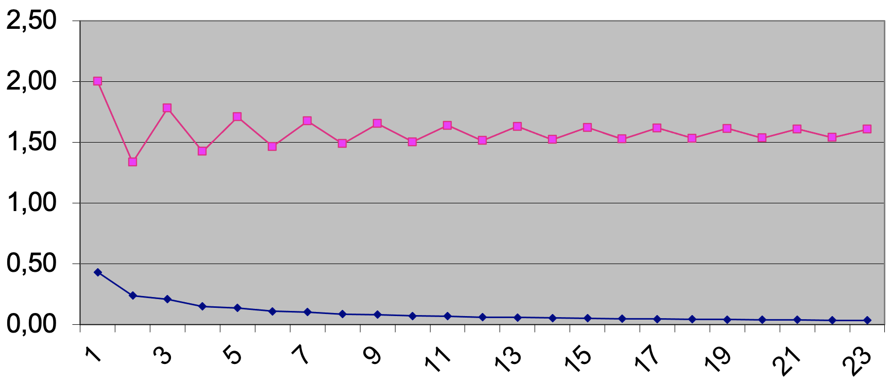

## 02 - Suite de Wallis

### Objectif
Par groupe de **4 étudiants**, développer un pseudo-code

La suite de Wallis est défini ainsi

	Pi/2 = 2/1 * 2/3 * 4/3 * 4/5 * 6/5 ..

### A faire
Le programme demandé doit

1. permettre la saisie d'un terme de Wallis (numérateur/dénominateur)
2. calculer l'approximation Pi/2 du 1er terme (2/1) jusqu'au terme saisi par l'utilisateur
3. afficher le résultat de l'approximation

Si le terme saisi n'était pas correct, le programme indiquerait le problème avant de terminer. Aucun calcul n'est effectué.

Sur cette base, proposer un **pseudo-code par raffinement successif**.

**NB** : Aucun code n'est demandé

<Details>
<Summary>Aide</Summary>

Une première approche peut être de le développer sur Excel pour bien comprendre le mécanisme.


Le premier niveau pourrait être

```
	1. message à l'utilisateur
	2. saisie du terme de Wallis
	3. si le terme saisi est correct
		1. calculer l'approximation de Wallis
		2. Afficher le résultat
	4. sinon
		1. affiche un message d'erreur
	5. afficher un message de fin
```
</Details>

### Complément
- n/a


### Temps / délai
- 2 périodes

---
Bon travail
