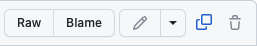

# Bienvenu sur le repo PRG1 de GMB

### Classes
- [PRG1-B](Classe_PRG1-B)
	- [Journal](Classe_PRG1-B/readme.md)
	- [Demos](Classe_PRG1-B/Demos_PRG1_B)
- [PRG1-E](Classe_PRG1-E)
	- [Journal](Classe_PRG1-E/readme.md)
	- [Demos](Classe_PRG1-E/Demos_PRG1_E)
- [Règles PRG1](Complements/regles_PRG1.md)

### Matériel
- [Supports de cours](Slides)
- [Exercices](https://github.com/PRG1-HEIGVD/PRG1_Recueil_Exercices)
- [Démonstrations](https://github.com/gmbreguet/PRG1_GMB_DEMO)
- [Compléments](Complements) 
- [Données laboratoire](Laboratoires) 
- [Prof et Assistants](Prof_Assistants.md)
- [Tutorat et Appui](Tutorat_Appui.md)

Comment utiliser ce git

Vous pouvez utiliser ce repo comme suit :

- Visualiser les codes dans votre navigateur avec l'URL

	`https://github.com/2024-PRG1-GMB/COURS`

- Copier/Coller un code en particulier dans votre IDE

	

- Cloner ce git entier avec la commande

	`git clone git@github.com:2024-PRG1-GMB/COURS.git`

- ... puis faire un pull régulièrement

	`git pull <votre répertoire>`

 
Bonne visite 
(C) Guy-Michel Breguet
